# freertos任务的创建

## 静态创建

在指定栈中创建任务。

函数

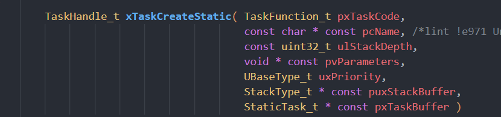

此函数返回值为其TCB结构体，使用此函数需要对以下函数进行定义

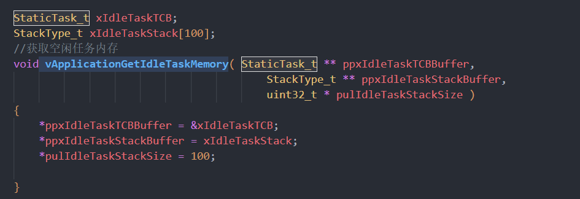

## freertos优先级管理规则

Freertos 优先级值越小优先级越低

高优先级的任务先执行且高优先级的任务不主动放弃执行，则会一直执行高优先级的任务
，其他低优先级的任务无法执行

同优先级的任务交叉执行
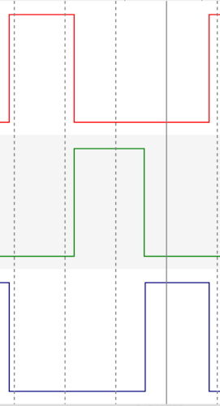

## 任务的处理

### 任务删除

函数

任务的删除通过处理任务的TCB结构体进行任务的删除

### 利用同一个任务函数创建多个任务

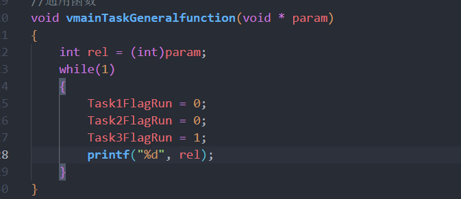

书写一个通用函数。任务执行时，同一个函数所用的栈是不同的，任务之间不会互相影响

## 栈大小

在创建任务时，栈不可设置的太小，若设计的太小会出现数据的损坏

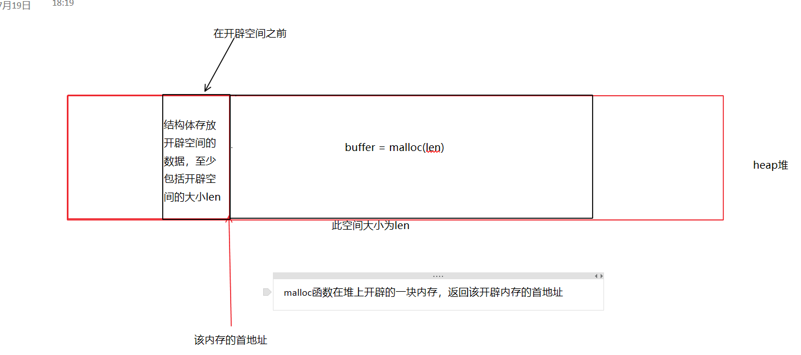

创建一个任务

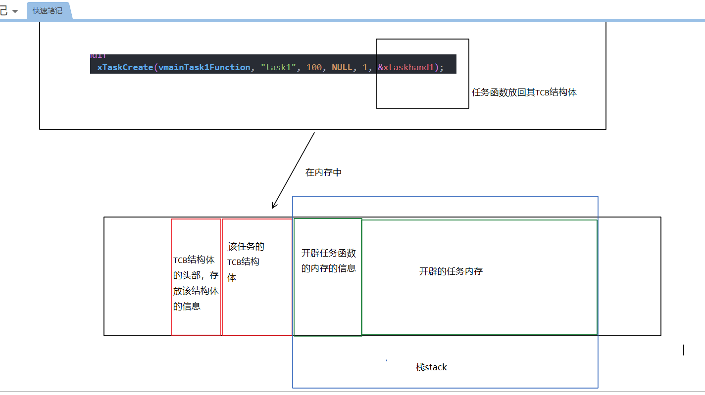

任务函数内的数据从后向前不断进行压栈操作

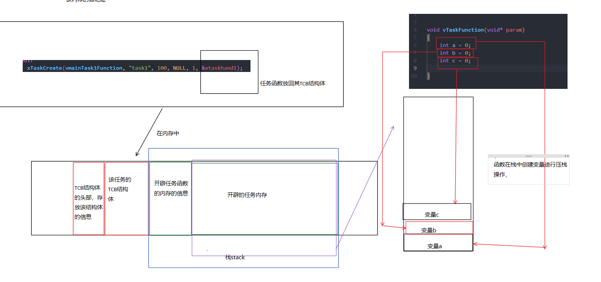

当创建的任务开辟的空间过小，由于变量的创建是从后向前的会使内存的头部，TCB结构体及其头部受到影响

## 任务管理

### 任务状态

FreeRTOS通过 **tick中断** 实现任务的切换
当我们通过分析一个任务高低电平之间的时间
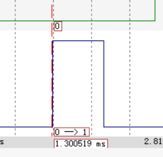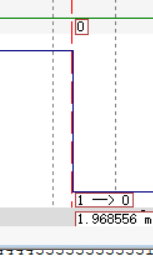
我们发现中间时间大致为0.7ms接近1ms，且之后的每个任务高低电平的之间的时间都是这个数字，实际上FreeRTOS的任务切换是通过 **tick中断** 来实现的，中断的时间设置在
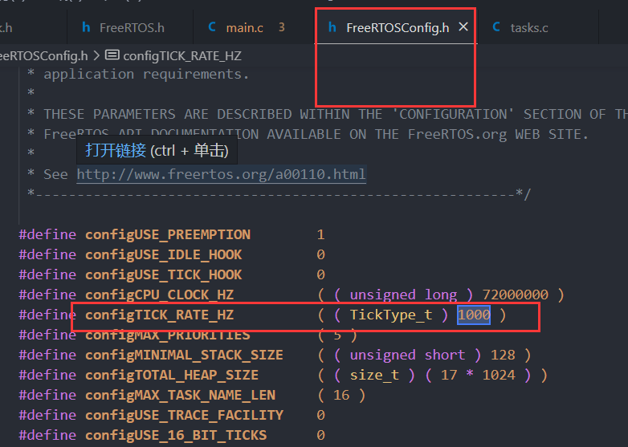
其任务切换如图所示

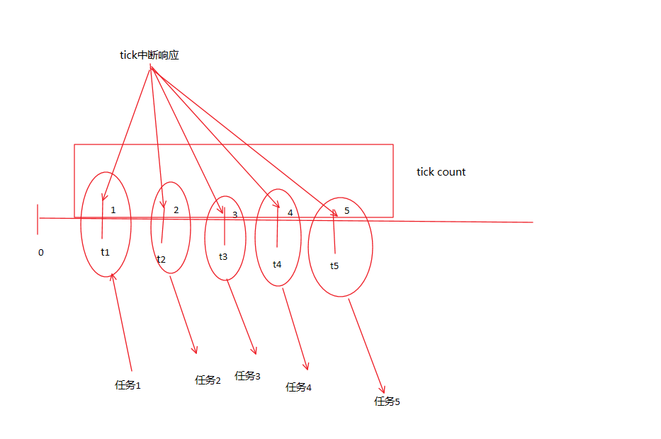

一个任务在FreeRTOS中有4种状态

1. running 运行状态
2. ready   就绪状态
3. blocked 阻塞状态
4. suspended 暂停状态

其转换关系如图

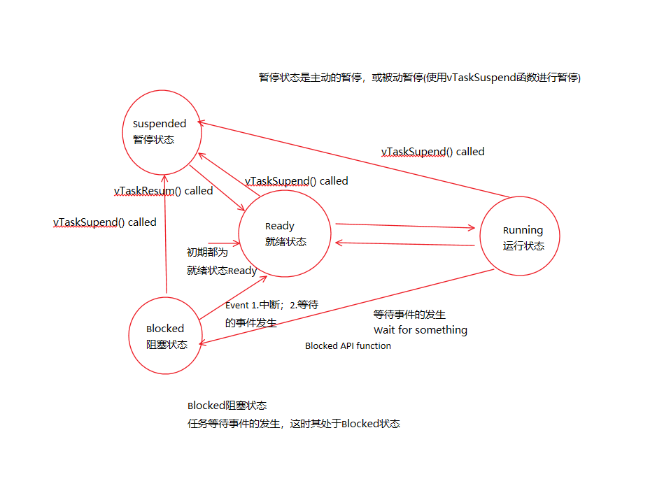

任务的管理是通过链表(list)进行实现的，当 **tick中断** 发生时各个任务处于链表中，在链表中选择要运行的任务

任务在创建时就加入了对应的链表
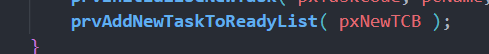

任务的暂停也相同
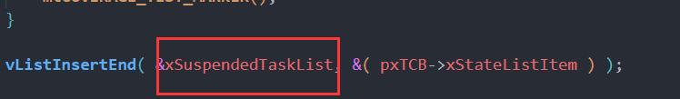

### Delay与DelayUntil函数

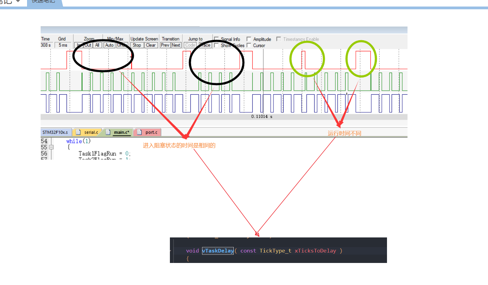

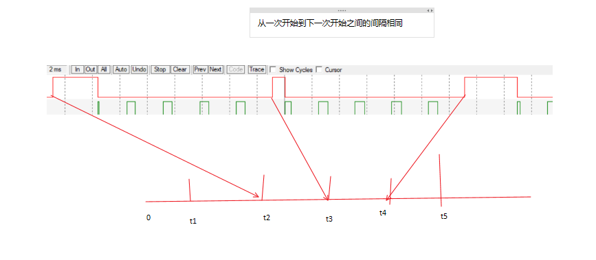

### 空闲任务

一个任务被其他任务删除，该任务所占内存会自我释放，而任务自杀，内存则无法自我释放，这时需要空闲任务(Idle)将其所占内存释放。

空闲任务可释放自杀的任务所占内存。
空闲任务不可使其进入暂停状态(Suspended)或阻塞状态(Blocked)

### 任务调度

